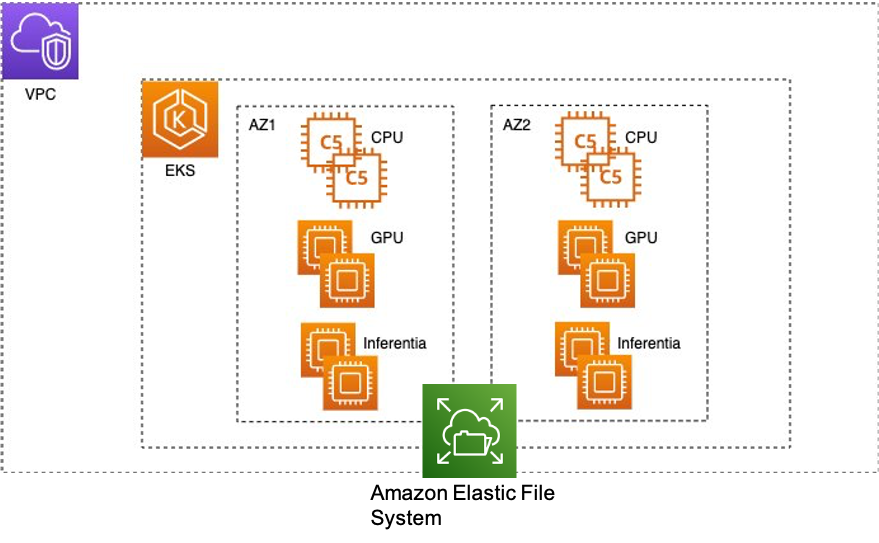
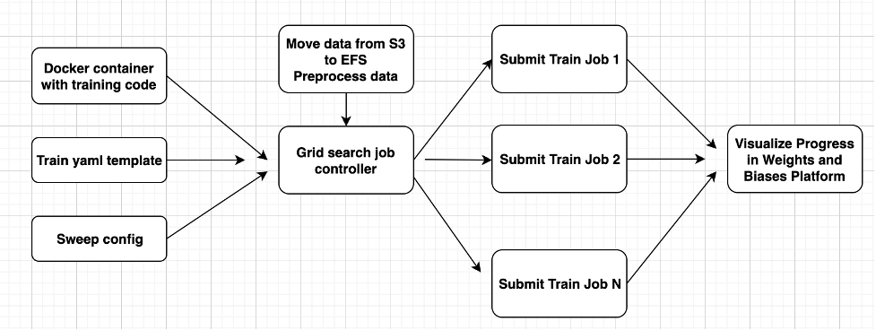

## Accelerate Deep Learning Hyperparameter Grid Search with Amazon EKS and Weights & Biases

# 1. Overviews
Hyperparameter optimization is highly computationally demanding for deep learning models. The architectural complexity increases when a single model training run requires multiple GPUs. In this repo, we will show how to use the Weights & Biases (W&B) Sweeps function and Amazon’s Elastic Kubernetes Service (EKS) to address these challenges. Amazon EKS is a highly available managed Kubernetes service that automatically scales instances based on load, and is well suited for running distributed training workloads. We will showcase an example for tuning a bert-base-cased model in a distributed data parallel way for classifying positive or negative sentiment for stock market data headlines. In the following sections, we will present the key components of the architecture shown in Fig. 1. More specifically, we will show:

1. How to set up an EKS cluster with a scalable file system
2. How to train PyTorch models using TorchElastic
3. Present a solution architecture integrating W&B with EKS and TorchElastic

<div align="center">

<br/>
Fig. 1 - Sample EKS infrastructure for hyperparameter grid search with deep learning models
</div>
<br/>

# 2. Cluster and Data Set up 
You can use this [repo](https://github.com/aws-samples/aws-do-eks) to create the cluster. [aws-do-eks](https://github.com/aws-samples/aws-do-eks) also includes steps to create and mount an Amazon Elastic File System (EFS_ volume on an EKS cluster [here](https://github.com/aws-samples/aws-do-eks/tree/main/Container-Root/eks/deployment/csi/efs). Also update docker.properties with your ECR registry path. We set up an EKS cluster with 3 p3.8xlarge instances with 4 Tesla V100 GPUs each. 

To try W&B for free, sign up at [Weights & Biases](https://wandb.ai/site), or visit the [W&B AWS Marketplace](https://aws.amazon.com/marketplace/pp/prodview-guj5ftmaeszay) listing. Please follow instructions [here](https://docs.wandb.ai/quickstart) to generate a W&B API key. For compatibility with W&B, it is standard practice to add WANDB_API_KEY as an environment variable and add wandb.login() at the very beginning of the code.

Once an EFS volume is mounted to the EKS cluster, a `/shared-efs` folder will be created that will be accesible by all nodes in the cluster. Download your training data in an S3 bucket. Then to move the data in EFS, run `./build.sh` from the [s3_efs](https://github.com/aws-samples/aws-do-grid-search-wand-eks/tree/main/s3_efs) folder to build the Docker image and do the same for `./push.sh` after updating the `data-prep.sh` script with relevant paths. Once that is done run `kubectl apply -f efs-data-prep-pod.yaml` to kickstart jobs to download data.
  
```console
cd ./s3_efs
./build.sh
./push.sh
kubectl apply -f efs-data-prep-pod.yaml
```

The process to submit a pre-processing job is very similar to above, with a few exceptions. Instead of a data-prep.sh script, you likely need to run a python job to pre-process the data. The preprocess folder has the scripts to run a pre-processing job. The [pre-process_data.py](https://github.com/aws-samples/aws-do-grid-search-wand-eks/blob/main/preprocess/pre-process_data.py) script accomplishes two tasks: it takes in the raw data in EFS and splits it into train and test files, and adds the data to the W&B project.

# 3. Training Setup
The [main.py](https://github.com/aws-samples/aws-do-grid-search-wand-eks/blob/main/run-grid/train/examples/huggingface/main.py) code, the run() function stores the end to end pipeline for:
a. Initializing wandb on node 0 for logging results
b. Loading the pre-trained model and setting up the optimizer
c. Initializing custom training and validation data loaders
d. Loading and saving checkpoints at every epoch
e. Looping through the epochs and calling the training and validation functions
f. After training is done, running predictions on the specified test set

The [train](https://github.com/aws-samples/aws-do-grid-search-wand-eks/tree/main/run-grid/train) folder contains the Dockerfile and the `build.sh` and `push.sh` scripts to create the Docker image with the training code.

Before training, we need to deploy a TorchElastic Controller for Kubernetes, which manages a Kubernetes custom resource ElasticJob to run TorchElastic workloads on Kubernetes. We also deploy a pod running the etcd server by running the script [deploy.sh](https://github.com/aws-samples/aws-do-grid-search-wand-eks/blob/main/run-grid/deploy.sh). It is recommended to delete and restart the etcd server when restarting a fresh training job.

# 4. Weights & Biases Sweep Config
After setting up the cluster and the container, we set up multiple runs in parallel with slightly different parameters in order to improve our model performance. [W&B Sweeps](https://docs.wandb.ai/guides/sweeps) will automate this kind of exploration. We set up a configuration file where we define the search strategy, the metric to monitor and the parameters to explore. An example sweep config file is shown [here](https://github.com/aws-samples/aws-do-grid-search-wand-eks/blob/main/run-grid/sweep_config.yaml). For more details on how to configure your sweeps follow the [W&B Sweeps walkthrough](https://docs.wandb.ai/guides/sweeps/quickstart#2-sweep-config).

# 5. Run grid search
Figure 2 shows how a grid search job controller shown in [run-grid.py](https://github.com/aws-samples/aws-do-grid-search-wand-eks/blob/main/run-grid/run-grid.py) code automates grid search with a W&B sweep config. This python job controller will take a [training template yaml](https://github.com/aws-samples/aws-do-grid-search-wand-eks/blob/main/run-grid/train.yaml) and generate one training yaml for each run in the hyper-parameter grid search.

<div align="center">

<br/>
Fig. 2 - Process flow to submit multiple training jobs on the EKS cluster based on W&B sweep config
</div>
<br/>


TODO: Fill this README out!

Be sure to:

* Change the title in this README
* Edit your repository description on GitHub

## Security

See [CONTRIBUTING](CONTRIBUTING.md#security-issue-notifications) for more information. Prior to any production deployment, customers should work with their local security teams to evaluate any additional controls


## License

This library is licensed under the MIT-0 License. See the LICENSE file.

